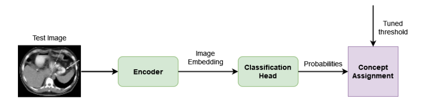

# (Medical) Image Tagger

This repository provides a basic model for (medical & imbalanced) multi-label image classification. 

--- 

<p align="center">

</p>

## Instructions

All the parameters are specified by a single Python dictionary that can be passed to the constructor of the class.
The data has to be in a .csv format like this:

<table>
  <tr>
    <th>image</th>
    <th>labels</th>
  </tr>
  <tr>
    <td>image1</td>
    <td>tag1;tag2;tag3</td>
  </tr>
  <tr>
    <td>image2</td>
    <td>tag4;tag1</td>
  </tr>
</table>

The program will read the .csv files into a Python dictionary. The two columns must be separated by a `\t`. Alternatively, you can load a JSON file directly as a `dict`. Next, the list with the categories (labels) can either be a Python list passed to the `configuration` or a `.txt` file with a label per line.
For the loss function binary cross-entropy, Focal loss[5], ASL loss[6] and soft F1 loss[7] are supported. For Focal and ASL losses, you have to specify the respective parameters of each loss.

## Example of Use

```python
from tagcxn import TagCXN

import tensorflow as tf

configuration = {
    'data': {
        'train_data_path': '...',  # .csv file or json file
        'val_data_path': '...',  # .csv file or json file
        'test_data_path': '...',  # .csv file or json file
        'skip_head': False,
        'img_size': (224, 224, 3),
        'tags': ['...', '...', '...']  # this can also be a path to a .txt file with the labels
    },
    'model': {
        # any instance of tf.keras.Model with its output being the representation of the image (not logits)
        # if a HuggingFace model is selected, data_format must be 'channels_first'
        'backbone': tf.keras.applications.EfficientNetV2B0(weights='imagenet',
                                                           include_top=False, ),
        'preprocessor': tf.keras.applications.efficientnet_v2,  # accompanying preprocessor
        'data_format': 'channels_last'
    },
    'model_parameters': {
        'pooling': 'avg',
        'repr_dropout': 0.2,
        'mlp_hidden_layers': [512, 512],  # two hidden layers
        'mlp_dropout': 0.2,
        'use_sam': False,
    },
    'training_parameters': {
        'loss': {
            'name': 'bce'
        },
        'epochs': 100,
        'batch_size': 16,
        'learning_rate': 1e-3,
        'patience_early_stopping': 3,
        'patience_reduce_lr': 1,
        'checkpoint_path': '...'  # path to save the best model
    },
    'save_results': True,
    'results_path': 'xxxx.csv'  # path to the results file

}

t = TagCXN(
    configuration=configuration
)

t.run()
```

## TO-DOs

## References

[1] Charalampakos M.Sc. Thesis ["Exploring Deep Learning Methods for Medical Image Tagging", 2022](http://nlp.cs.aueb.gr/theses/f_charalampakos_msc_thesis.pdf) <br />
[2] Charalampakos et al. ["AUEB NLP Group at ImageCLEFmedical Caption 2022" Proceedings of the Conference and Labs of the Evaluation Forum (CLEF 2022), 2022](http://ceur-ws.org/Vol-3180/paper-101.pdf) <br />
[3] Karatzas et al. ["AUEB NLP Group at ImageCLEFmed Caption 2020" Working Notes of the Conference and Labs of the Evaluation Forum (CLEF 2020), 2020](http://nlp.cs.aueb.gr/pubs/AUEB_NLP_Group_at_ImageCLEFmed_Caption_2020.pdf) <br />
[4] Kougia et al. ["AUEB NLP Group at ImageCLEFmed Caption 2019" Working Notes of the Conference and Labs of the Evaluation Forum (CLEF 2019), 2019](http://nlp.cs.aueb.gr/pubs/paper_136.pdf) <br />
[5] Focal loss: [Lin et. al "Focal Loss for Dense Object Detection" Proceedings of the IEEE International Conference on Computer Vision (ICCV),  2017](https://arxiv.org/pdf/1708.02002.pdf) <br />
[6] ASL loss: [Ridnik et. al "Asymmetric Loss For Multi-Label Classification" Proceedings of the IEEE/CVF International Conference on Computer Vision (ICCV), 2021](https://openaccess.thecvf.com/content/ICCV2021/papers/Ridnik_Asymmetric_Loss_for_Multi-Label_Classification_ICCV_2021_paper.pdf) <br />
[7] [soft F1 loss](https://towardsdatascience.com/the-unknown-benefits-of-using-a-soft-f1-loss-in-classification-systems-753902c0105d) <br />
[8] SAM: [Foret et al. "Sharpness-aware Minimization for Efficiently Improving Generalization" ICLR 2021](https://iclr.cc/virtual/2021/poster/2782)

